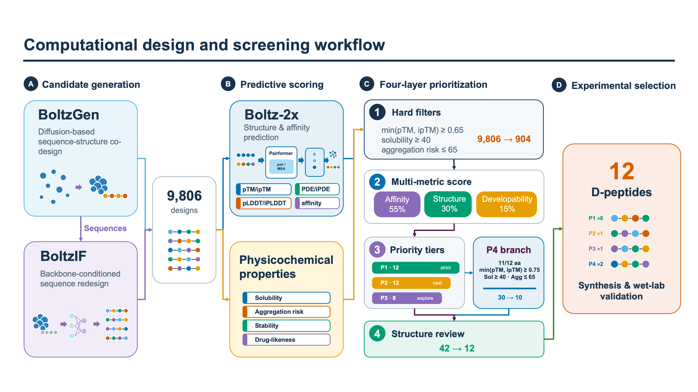

# Stereochemistry-aware multi-model D-peptide design

> **From open foundation models to an auditable D-peptide design system.**

[](https://github.com/PerinMu/hIAPP-D-peptide-design/actions/workflows/validate.yml)
[](https://www.python.org/)
[](LICENSE)

## 中文评审快速入口

本仓库是第一届全球大学生生命科学挑战赛 Track 1 的公开代码与可复现性材料。
项目提供一套通用的 D-肽从头设计与多指标筛选流程，并以 hIAPP 为案例筛选出
12 条候选 D-肽。

- **一键复现筛选：** 运行 `bash run.sh`，生成标准化的 12 条候选结果。
- **查看完整计算流程：** [BoltzGen → BoltzIF → Boltz-2 → 多指标筛选 Notebook](notebooks/00_full_generation_to_selection.ipynb)。
- **查看最终材料：** [结果 CSV](results/submission/results.csv) · [结果 Excel](results/submission/results.xlsx) · [预测复合物结构](results/final_candidates/structures/)。
- **核对竞赛要求：** [附件5合规表](docs/COMPETITION_COMPLIANCE.md) · [赛道评分对照](docs/SCORING_ALIGNMENT.md) · [Model Card](MODEL_CARD.md)。

湿实验正在进行，本公开版本不把计算分数表述为实测活性。更多说明见
[中文评审导航](README_CN.md)。

---

**Official public code and reproducibility package for Track 1 of the First
Global University Student Life Science Challenge.**

[Chinese evaluator guide](README_CN.md) ·
[Competition requirement checklist](docs/COMPETITION_COMPLIANCE.md) ·
[Standardized results](results/submission/results.csv)

An end-to-end, auditable framework for **structure-guided de novo D-peptide
design**. Rather than fitting a task-specific model to the structurally sparse
D-peptide–L-protein data regime, it orchestrates complementary open-source
pretrained models through a project-developed, stereochemistry-aware decision
layer. The workflow connects all-atom sequence–structure co-design, inverse
folding, explicit chirality specification and validation, cross-model complex
assessment, interpretable developability analysis, diversity-aware
multi-objective prioritization, and experimental handoff.

Human islet amyloid polypeptide (hIAPP) is the worked case study. Starting from
PDB 9ULZ, the campaign generated a 9,806-design ranking pool and selected 12
reverse-D peptides for testing as inhibitors of amyloid aggregation. The same
framework can be adapted to another structurally characterized target by
replacing the target structure, binding-site definition, campaign parameters,
and assay plan.



## Submission scope

This repository is maintained as the public competition submission and its
reproducibility record. It contains the code, configurations, documented model
invocations, committed intermediate tables, predicted structures, standardized
candidate files, and evidence needed for evaluator review. Updates are limited
to submission corrections, reproducibility evidence, and validated project
results.

The team did not train or fine-tune BoltzGen, BoltzIF, or Boltz-2. The project
contribution is a **stereochemistry-aware multi-model orchestration framework**:
target-conditioned all-atom generation, backbone-conditioned diversification,
explicit chirality specification and computational validation, cross-model
structural and direction-aware affinity consensus, developability-aware
multi-objective optimization, diversity-constrained priority tiers, and an
auditable hIAPP case study. Wet-lab validation is in progress; no measured
activity is claimed in this release.

## Highlights

- **General, target-adaptable architecture:** target preparation, generative
  design, sequence diversification, D-stereochemical conversion, model-based
  validation, multi-metric screening, structure review, and wet-lab handoff.
- **Modern all-atom generation:** BoltzGen jointly samples amino-acid identities
  and all-atom structures while conditioning on the target and intended binding
  site, reducing dependence on a manually fixed peptide scaffold or a single
  physics-based energy function.
- **Complete hIAPP case study:** 2,000 requested designs, BoltzIF
  diversification, 9,806 ranked candidates, four-layer prioritization, and a
  12-peptide synthesis set targeting the amyloidogenic hIAPP region.
- **Two levels of reproducibility:** a full GPU/Slurm notebook for end-to-end
  regeneration and a fast CPU notebook that reproduces every reported count
  from committed data.
- **Interpretable multi-objective selection:** affinity-head consensus,
  structure confidence, solubility, aggregation risk, stability, diversity, and
  manual interface review are documented separately.
- **Stereochemistry-aware model bridge:** reverse-D transformation is coupled
  to residue-level chirality specification, explicit isomeric SMILES, and
  computational checks of sequence order and stereocentre assignment before
  independent complex assessment.
- **Traceable evidence:** each final peptide connects to source sequences,
  prediction scores, selection tier, review stage, and a model-0 complex CIF.
- **Automated quality control:** GitHub Actions executes the screening notebook
  and checks scripts, HPC templates, language consistency, reference coverage,
  and candidate-count invariants on every update.

## Start here

| Resource | What it provides |
|---|---|
| **[`run.sh`](run.sh)** | Competition evaluator entry point: one CPU command reproduces screening and writes the standardized 12-candidate `results.csv`. |
| **[Chinese evaluator guide](README_CN.md)** | Concise Chinese navigation for quick review; the English technical record remains authoritative. |
| **[Scoring alignment](docs/SCORING_ALIGNMENT.md)** | Direct map from the five competition scoring categories to repository evidence and current evidence boundaries. |
| **[Model Card](MODEL_CARD.md)** | Third-party model provenance, production configuration, hardware, scope, inputs/outputs, uncertainty, and known limitations. |
| **[Scientific background and innovation](docs/BACKGROUND.md)** | D-peptide rationale, comparison with established discovery routes, framework scope, and evidence boundaries. |
| **[Full design-to-selection notebook](notebooks/00_full_generation_to_selection.ipynb)** | Step-by-step BoltzGen generation, BoltzIF redesign, chirality specification and validation, Boltz-2 prediction, evidence integration, multi-objective screening, and structure review on a Slurm GPU server. |
| **[Screening reproduction notebook](notebooks/01_reproduce_screening.ipynb)** | CPU-only reconstruction of every reported screening count and the final candidate manifest from committed data. |
| **[Final 12 candidates](results/final_candidates/final_12.csv)** | Machine-readable synthesis shortlist with priority tier, design provenance, experimental status, and structure filenames. |
| **[Predicted complexes](results/final_candidates/structures/)** | Boltz-2 model-0 CIF structures used during manual review. |
| **[Methods](docs/METHODS.md)** | Exact ranking equations, thresholds, tier definitions, and selection logic. |
| **[Physicochemical calculations](docs/PHYSICOCHEMICAL.md)** | Descriptor equations, assumptions, limitations, and supporting literature. |
| **[References](docs/REFERENCES.md)** | Target biology, model, descriptor, and representative inhibitor bibliography. |
| **[Attachment 5 compliance](docs/COMPETITION_COMPLIANCE.md)** | Requirement-by-requirement code-submission checklist. |

## Competition evaluator quick start

This repository is submitted to **Track 1: AI Macromolecule and Peptide Drug
Design**. The team used pretrained open-source BoltzGen, BoltzIF, and Boltz-2
models and did not train or fine-tune a model.

```bash
git clone https://github.com/PerinMu/hIAPP-D-peptide-design.git
cd hIAPP-D-peptide-design
conda env create -f environment.yml
conda activate hiapp-d-peptide-analysis
bash run.sh
```

The entry point recomputes the screening funnel from the committed score table,
validates all review-stage counts and structure links, and writes:

- [`results/submission/results.csv`](results/submission/results.csv):
  authoritative UTF-8 candidate manifest;
- [`results/submission/results.xlsx`](results/submission/results.xlsx): formatted
  convenience mirror;
- `results/submission/run_metadata.json`: run timestamp, repository revision,
  software/platform versions, input hashes, and output hash.

The CPU reproduction uses deterministic ranking code and does not require the
GPU model environments. Full stochastic regeneration from PDB 9ULZ is provided
in the primary notebook and Slurm templates.

| Reproduction path | Hardware | Expected scope and runtime |
|---|---|---|
| Evaluator command, `bash run.sh` | CPU only | Rebuilds the complete deposited screening funnel and 12-row UTF-8 result file; normally completes in under one minute after dependencies are installed |
| Full BoltzGen/BoltzIF/Boltz-2 regeneration | NVIDIA GPU Slurm platform | Recreates stochastic generation and prediction; production allocations, observed timings, retries, and GPU-hour accounting are reported in the [production environment record](docs/PRODUCTION_ENVIRONMENT.md) |

## Key results

| Stage | Recorded result | Auditable artifact |
|---|---:|---|
| BoltzGen designs requested / completed | 2,000 / 1,990 | Full workflow notebook |
| Unique BoltzGen sequences | 1,956 | [`batch1_design.csv`](data/designs/batch1_design.csv) |
| BoltzIF sequences / unique | 7,960 / 7,854 | [`batch1_IF_02.csv`](data/designs/batch1_IF_02.csv) |
| Unique merged designs | 9,808 | [`merged_designs.csv`](data/designs/merged_designs.csv) |
| Designs entering ranking | 9,806 | [`merged_all_2_scored.csv`](data/scored/merged_all_2_scored.csv) |
| Hard-gated candidates | 904 | [`hard_gate_904.csv`](results/screening/hard_gate_904.csv) |
| P1 / P2 / P3 review candidates | 12 / 12 / 8 | [`p1_p2_p3_top32.csv`](results/screening/p1_p2_p3_top32.csv) |
| P4 eligible / structure-review candidates | 30 / 10 | [`p4_top10.csv`](results/screening/p4_top10.csv) |
| Final synthesis candidates | **12** | [`final_12.csv`](results/final_candidates/final_12.csv) |

The final shortlist comprises **P1 × 8, P2 × 1, P3 × 1, and P4 × 2**. Every
selected peptide is linked to a predicted hIAPP complex structure.

<details>
<summary><strong>Show the final 12 D-peptide sequences</strong></summary>

| Final rank | Tier | D-peptide sequence |
|---:|:---:|---|
| 1 | P1 | `dvdiiv` |
| 2 | P1 | `epirip` |
| 3 | P1 | `fsltiegssti` |
| 4 | P1 | `ninitpg` |
| 5 | P1 | `pnsitltsssg` |
| 6 | P1 | `slslssgevtv` |
| 7 | P1 | `ttiillsyd` |
| 8 | P1 | `vnpipy` |
| 9 | P2 | `sldikp` |
| 10 | P3 | `siiidstitls` |
| 11 | P4 | `fsvtlngsntv` |
| 12 | P4 | `lnvsislttag` |

Lower-case letters denote the all-D sequence convention used by this project.

</details>

## Scientific rationale and innovation

D-peptides preserve peptide-like recognition chemistry while generally
resisting proteolytic degradation better than their L-enantiomeric counterparts.
Established discovery routes include mirror-image phage display and
structure-based methods built around hotspot grafting, predefined scaffolds,
docking, empirical energy functions, free-energy calculations, and molecular
dynamics. These approaches are valuable, but can require a chemically
synthesized mirror target, a known interaction motif, a suitable scaffold, or
substantial per-candidate sampling.

This framework explores a complementary route. Instead of training a new model
on an underpowered task-specific dataset, it transfers complementary capability
from recent open-source pretrained models into a D-peptide design system.
BoltzGen jointly generates residue identities and three-dimensional structure
while conditioning on a target and binding site; BoltzIF expands
backbone-conditioned sequence diversity; the project-developed stereochemical
bridge specifies and verifies reverse-D representations; Boltz-2 supplies an
independent complex assessment; and a transparent decision layer integrates
direction-aware affinity consensus, structural confidence, developability, and
diversity constraints.

The innovation is therefore not another black-box foundation model, but the
translation of complementary model capabilities into **broader candidate-space
exploration with a fully traceable selection path**. This is not an unqualified
claim that one model outperforms every established D-peptide method;
experimental performance remains target- and assay-dependent. See the full
[background and method comparison](docs/BACKGROUND.md).

## hIAPP case study

hIAPP aggregation and islet amyloid are associated with beta-cell dysfunction
in type 2 diabetes. The case study targets its amyloidogenic C-terminal region:
PDB 9ULZ chain D residues 19–37 are retained, and residues 21–37 define the
intended binding region.

This is a demanding multi-objective problem. A useful anti-aggregation candidate
must combine plausible target engagement with structural confidence, low
self-aggregation risk, adequate solubility and stability, sequence diversity,
and synthetic tractability. The hIAPP campaign demonstrates the complete
computational funnel and produces a traceable 12-peptide experimental shortlist.
Measured inhibition is not inferred from model scores; activity claims require
deposited dose–response and replicate-level assay data.

## Workflow

1. **Target and site specification** — define the target structure, retained
   region, intended binding residues, and peptide design constraints.
2. **BoltzGen all-atom co-design** — jointly generate peptide sequence and
   structure in the target context; the hIAPP campaign requested 2,000 designs
   with the `peptide-anything` protocol.
3. **BoltzIF sequence diversification** — four sequences per backbone at
   temperature 0.2, with cysteine excluded.
4. **Reverse-D encoding** — sequence reversal plus explicit D stereochemistry
   in linear-peptide SMILES.
5. **Boltz-2 prediction** — target–peptide complex structures, confidence
   metrics, and three affinity heads.
6. **Physicochemical characterization** — transparent sequence-only
   solubility, aggregation-risk, stability, permeability, and drug-likeness
   tendencies.
7. **Four-layer prioritization** — hard filters, multi-metric ranking, P1–P4
   tiers, sequence de-redundancy, and manual structure review.
8. **Experimental handoff** — a diverse candidate set with traceable scores,
   predicted complexes, and a predefined assay-data schema.

## Adapting the framework to a new target

The reusable computational logic is target-agnostic; the biological inputs and
decision thresholds are campaign-specific. To start a new campaign:

1. replace the target structure and record its provenance;
2. select the retained chains/residues and define the intended binding site;
3. adjust peptide length, residue, cyclization, and generation constraints;
4. update the Boltz-2 target/template YAML and run-size parameters;
5. calibrate hard gates and ranking weights for the target and assay; and
6. predefine appropriate activity, selectivity, toxicity, positive-control, and
   negative-control experiments.

The notebooks expose these values in parameter cells rather than hiding them in
analysis code.

## Installation and dependencies

### 1. Clone the repository

```bash
git clone https://github.com/PerinMu/hIAPP-D-peptide-design.git
cd hIAPP-D-peptide-design
```

### 2. Analysis and notebook environment

Python 3.11 or newer is recommended. This environment reproduces screening,
tables, plots, physicochemical descriptors, and repository validation without
requiring model inference.

```bash
python3 -m venv .venv
source .venv/bin/activate
python -m pip install --upgrade pip
python -m pip install -r requirements.txt
```

Core analysis dependencies are version-bounded in [`requirements.txt`](requirements.txt).
The exact evaluator reference environment, including Python 3.11.9 and pinned
package versions, is available in [`environment.yml`](environment.yml).

### 3. GPU model environments

Use separate environments for BoltzGen and Boltz, following their official
installation guidance:

```bash
# BoltzGen: Python >=3.11; Python 3.12 follows the official example
conda create -n boltzgen python=3.12 -y
conda activate boltzgen
python -m pip install --upgrade boltzgen
boltzgen --help

# Boltz-2 with CUDA support
conda create -n boltz python=3.11 -y
conda activate boltz
python -m pip install --upgrade 'boltz[cuda]'
boltz predict --help
```

Production generation and prediction require a CUDA-capable NVIDIA GPU. The
repository provides Slurm templates for multi-job execution and retry recovery.

The recovered production stack identifies `boltzgen` 0.2.0 and a still-installed
`boltz` 2.2.1 environment. BoltzGen used a hashed Ubuntu 22.04 CUDA 12.4.1/cuDNN
9.1 Singularity image; Boltz-2 used CUDA 12.8 and RTX 4090 jobs. Generation and
inverse folding requested four GPUs, while prediction used one GPU per job with
up to eight concurrent jobs. Exact checkpoint and container hashes, dependency
snapshots, hardware distinctions, scheduler evidence, and the remaining seed
and service-version limitations are documented in the [Model Card](MODEL_CARD.md)
and [production environment record](docs/PRODUCTION_ENVIRONMENT.md). No missing
value is silently inferred.

Sanitized full package snapshots are committed as
[`environments/boltzgen-production-pip-freeze.txt`](environments/boltzgen-production-pip-freeze.txt)
and [`environments/boltz2-production-pip-freeze.txt`](environments/boltz2-production-pip-freeze.txt).

### 4. Model downloads and caches

BoltzGen downloads its required inference assets on first use. The official
documentation estimates approximately 6 GB and uses `~/.cache` by default.
Assets can be downloaded in advance and placed in a dedicated shared cache:

```bash
conda activate boltzgen
boltzgen download all --cache /path/to/boltzgen_cache
```

Alternatively, use `--cache /path/to/cache` with BoltzGen commands or set
`HF_HOME`. Boltz-2 downloads its checkpoints and molecular data on first use;
set `BOLTZ_CACHE` to control their location:

```bash
export BOLTZ_CACHE=/path/to/boltz_cache
```

Model weights are provided by the official projects and are not duplicated in
this repository. See the [BoltzGen installation and download guide](https://github.com/HannesStark/boltzgen)
and [Boltz installation guide](https://github.com/jwohlwend/boltz) for current
hardware and package details.

## Run the notebooks

### Complete design-to-selection workflow

Open the primary notebook:

```bash
jupyter lab notebooks/00_full_generation_to_selection.ipynb
```

The first parameter cell centralizes the server project root, Conda activation
script, environment names, cache paths, and checkpoints. Review the generated
commands with `RUN_CPU_STEPS=False` and `SUBMIT_GPU_STEPS=False`; enable the
corresponding switch when the configured paths are ready. The notebook then
guides the complete sequence:

```text
9ULZ preparation → 2,000 BoltzGen designs → BoltzIF redesign
→ reverse-D SMILES → Boltz-2 YAML generation → parallel prediction
→ failed-job recovery → score collection → physicochemical properties
→ P1–P4 screening → structure review → final 12
```

The GPU steps use the portable scripts in [`hpc/`](hpc/) and preserve a clear
record of each input, output, retry, and score table.

### Reproduce the screening results

```bash
source .venv/bin/activate
jupyter lab notebooks/01_reproduce_screening.ipynb
```

Run all cells in order. Assertions verify the complete funnel:

```text
9,806 ranked designs → 904 hard-gated candidates
→ P1/P2/P3 = 12/12/8 → P4 = 30 eligible, 10 reviewed
→ 12 final candidates
```

For a non-interactive reproducibility check:

```bash
jupyter nbconvert --to notebook --execute \
  notebooks/01_reproduce_screening.ipynb \
  --output /tmp/01_reproduce_screening.executed.ipynb \
  --ExecutePreprocessor.timeout=600
```

## Screening strategy

All percentile scores are calculated over the mixed BoltzGen/BoltzIF pool; no
source quota is applied.

- **Hard gate:** complete affinity heads, `min(pTM, ipTM) >= 0.65`, solubility
  tendency `>= 40`, and aggregation risk `<= 65`.
- **Affinity consensus:** median agreement across three direction-aware
  affinity-head scores.
- **Structure quality:** 60% structure bottleneck, 20% confidence, and 20%
  inverse complex PDE percentile.
- **Developability:** favorable percentiles of solubility, aggregation risk,
  stability, peptide drug-likeness, and sequence-liability count.
- **Main ranking:** 55% affinity consensus, 30% structure quality, and 15%
  developability.
- **P1–P3:** high-confidence, continuation, and exploration tiers with
  normalized Levenshtein de-redundancy.
- **P4:** a dedicated 11–12-aa branch emphasizing structure confidence and
  additional interface-forming potential.
- **Final review:** predicted binding-region occupancy, interface contacts,
  hydrogen bonds, clashes, chain continuity, sequence diversity, and synthetic
  feasibility.

Exact equations are available in [`docs/METHODS.md`](docs/METHODS.md).

## Transparent physicochemical calculations

[`scripts/score_sequence_properties.py`](scripts/score_sequence_properties.py)
implements deterministic, inspectable descriptors rather than a hidden trained
model. Direct outputs include molecular mass, idealized charge at pH 7,
estimated pI, Kyte–Doolittle mean hydropathy, residue fractions, and the longest
hydrophobic run. Composite 0–100 tendencies support within-pool prioritization.

Every equation, residue set, pKa assumption, weight, limitation, and supporting
reference is documented in
[`docs/PHYSICOCHEMICAL.md`](docs/PHYSICOCHEMICAL.md). The literature motivates
the descriptor concepts; the composite weights and thresholds are explicitly
identified as project-specific heuristics.

## Data and result provenance

| Path | Contents |
|---|---|
| [`configs/`](configs/) | PDB 9ULZ and BoltzGen/Boltz-2 input templates. |
| [`data/designs/`](data/designs/) | Generated sequences, merged reverse-D encodings, SMILES, and the reference-inhibitor set. |
| [`data/scored/`](data/scored/) | Committed structure, affinity, and sequence-property table used for reproduction. |
| [`results/screening/`](results/screening/) | Hard-gate, P1–P3, P4, and funnel-summary tables. |
| [`results/final_candidates/`](results/final_candidates/) | Final 12 manifest and predicted complexes. |
| [`results/submission/`](results/submission/) | Standardized competition `results.csv`, formatted workbook mirror, and field definitions. |
| [`scripts/`](scripts/) | Reusable extraction, conversion, prediction-input, collection, scoring, screening, and review utilities. |
| [`hpc/`](hpc/) | Slurm submission, bounded-concurrency, and failed-job recovery templates. |
| [`wetlab/`](wetlab/) | Structured assay plan and raw-data template for experimental validation. |

The 76-entry reference-inhibitor set is linked to a grouped English provenance
index in [`reference_inhibitor_sources.csv`](data/designs/reference_inhibitor_sources.csv).
The [data dictionary](docs/DATA_DICTIONARY.md) defines every analysis field.
Dataset origin, acquisition dates, preprocessing, licensing, split
applicability, and leakage controls are consolidated in
[`docs/DATA_PROVENANCE.md`](docs/DATA_PROVENANCE.md).

## Reproducibility features

- Committed inputs, exact intermediate counts, score tables, and final
  structures.
- Two complementary notebooks: full GPU workflow and lightweight CPU
  reproduction.
- Path-configurable Slurm templates with bounded parallelism and resumable
  dispatch state.
- Automatic detection and regeneration of missing Boltz-2 outputs.
- Deterministic percentile scoring and sequence de-redundancy for a fixed input
  table.
- Assertions for every published funnel count and final-manifest membership.
- GitHub Actions validation of scripts, HPC syntax, English-language content,
  source coverage, screening outputs, and executable notebook reproduction.
- Explicit separation of model predictions, physicochemical heuristics, manual
  review, and future experimental evidence.
- A single competition entry point that records input/output SHA256 checksums
  and runtime metadata while regenerating the standardized final manifest.

## Experimental validation

The computational shortlist is prepared for synthesis and wet-lab evaluation.
The planned validation includes ThT aggregation kinetics across peptide
concentrations, hIAPP-only and vehicle controls, positive controls L-TQNWVP and
D-nfgail, independent repeats, concentration-response analysis, and an
orthogonal morphology or structure assay where available. The
[`wetlab/`](wetlab/) directory provides a consistent raw-data schema so future
measurements can be linked directly to candidate IDs and analysis outputs.

No experimental activity value is inferred from a model score. Boltz-2 affinity
heads are used as relative prioritization signals for peptide ligands and are
interpreted together with structure confidence, developability, and wet-lab
results.

## Documentation

- [Scientific background and framework scope](docs/BACKGROUND.md)
- [Model Card](MODEL_CARD.md)
- [Computational methods](docs/METHODS.md)
- [Physicochemical equations and references](docs/PHYSICOCHEMICAL.md)
- [Data dictionary](docs/DATA_DICTIONARY.md)
- [Data provenance, licensing, and leakage controls](docs/DATA_PROVENANCE.md)
- [Reproducibility and count reconciliation](docs/REPRODUCIBILITY.md)
- [Competition scoring alignment](docs/SCORING_ALIGNMENT.md)
- [Competition requirement checklist](docs/COMPETITION_COMPLIANCE.md)
- [Scientific bibliography](docs/REFERENCES.md)

## Citation and license

Citation metadata are provided in [`CITATION.cff`](CITATION.cff). Scientific
use should also cite BoltzGen, Boltz-2, and PDB 9ULZ as listed in
[`docs/REFERENCES.md`](docs/REFERENCES.md).

Repository code is released under the [MIT License](LICENSE). External model
weights, packages, and structural data remain subject to their respective
licenses and terms. BoltzGen and Boltz currently publish their code under the
MIT License; evaluators should verify the linked upstream licenses and weight
terms for the exact version they download.

This release is a research and competition artifact. Predicted affinity,
structure, and developability scores are prioritization signals, not clinical
claims or experimentally measured therapeutic effects.
